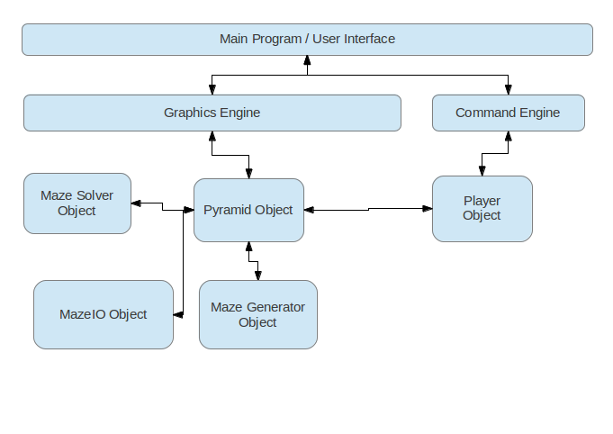

# python-mazegame

A Python program which generates mazes to be solved by a player.

This project has been submitted as a project work for Aalto University's course T-106.1215 Ohjelmoinnin peruskurssi osa 2, in the year 2013.

## What works or doesn't

 * Generating mazes: Sometimes the algorithm may never reach an end. Solvability of the generated mazes is not guaranteed.
 * Saving and loading mazes from text files
 * Playing the game
 * Graphics
 * Command engine
 * Algorithm to solve mazes: Solver algorithm doen't work for mazes loaded from files. Also the solution visualizer isn't that visual.

## Project architecture

